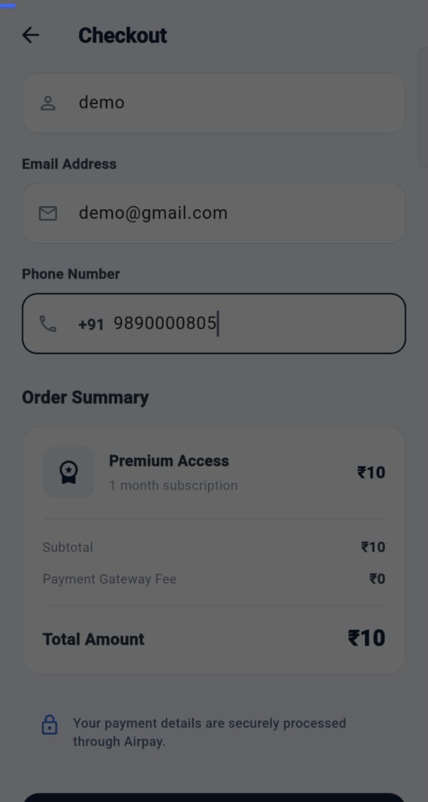
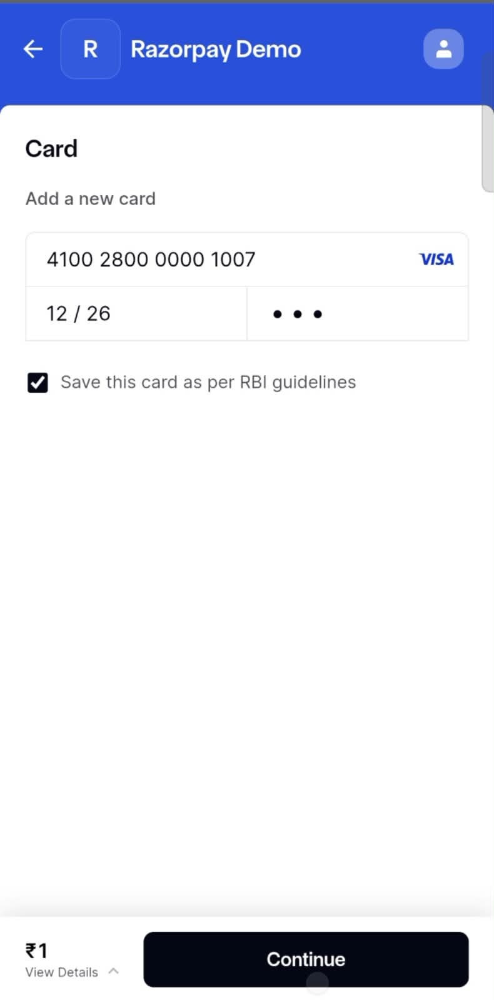
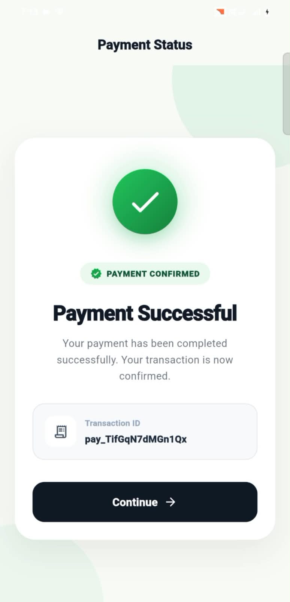

# PayDemo 💳

A Flutter demo app showcasing Razorpay payment gateway integration
(test/sandbox mode — no real transactions).

## Features

* Razorpay checkout integration
* Secure API key handling (.env, not committed to repo)
* Payment success/failure callback handling
* Clean error states

## Tech Stack

* Flutter
* Razorpay Flutter SDK
* flutter_dotenv (secure key management)

## Screenshots

| Home Screen                    | Checkout                               | Razorpay                               | Success                             |
|--------------------------------|----------------------------------------|----------------------------------------|-------------------------------------|
|  |  |  |  |

## Demo Video

Video will be added here after push (see below).

## Security Note

This project uses a `.env` file for the Razorpay test key, which is excluded
via `.gitignore`. The key is not included in this repository.

## Setup

```bash
flutter pub get
flutter run
```
